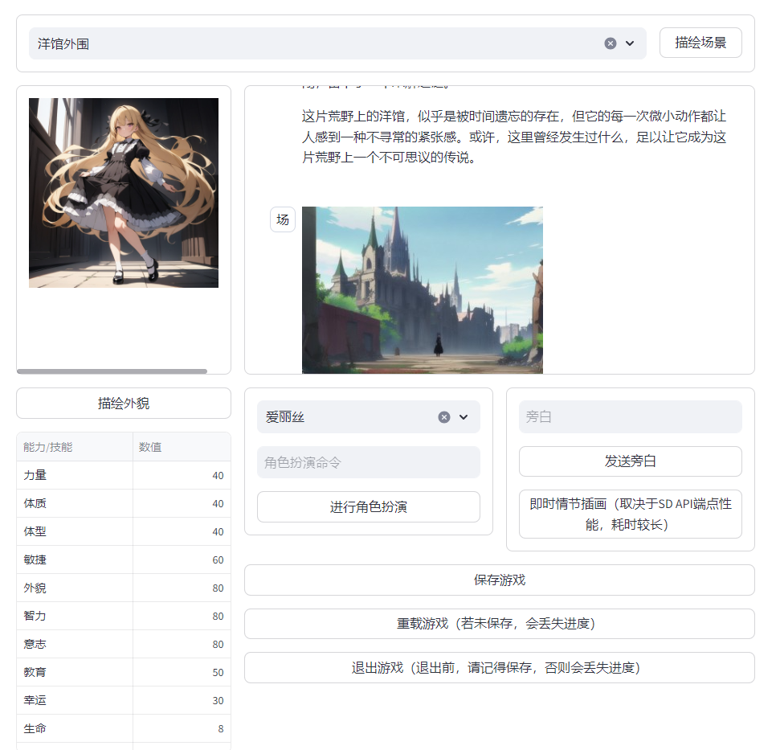

# COC Agent
基于多种AIGC的跑团辅助系统
## 简介
`COC Agent` 是一个基于多智能体的跑团辅助系统，旨在帮助游戏主持人（KP）和玩家更高效、更有趣地进行游戏（TRPG）。

本系统将跑团的过程抽象为若干个”场景“，主持人和玩家在不同的场景中与非玩家角色、场景元素等进行交互，推动游戏进行。

虽然故事的描述大多交由大语言模型进行生成，但故事的走向是由主持人和玩家共同决定的。

本项目分为四部分：App本体，LLM API，Stable Diffusion API和Voicevox Engine。

- App本体：前端基于streamlit.io开发，以游戏ID标志一局游戏的存在，持有相同游戏ID的人可以进入到同一游戏中。后端为自研的Multi-Agent协调系统，其主旨为利用AIGC增进TRPG游戏体验。
- LLM API：OpenAI式chat_complete的接口，由后端调用，用于提供文本生成功能。
- Stable Diffusion API：标准的Stable Diffusion Web API，启动Stable Diffusion实例时使用`--api`选项开启。
- Voicevox Engine：提供日语TTS功能。

## 特点
- **智能体协作**：多个智能体协同工作，自动化游戏流程和非玩家角色角色扮演。
- **模组管理**：提供了录入模组、角色的页面，系统自动维护模组游玩进程，简化KP的管理工作。
- **多人游玩**：系统支持一位主持人和复数位玩家同时参与到同一游戏中进行游玩。
- **AIGC**：录入模组、角色，抑或游玩过程中，都可以利用AIGC的便利功能来增进游戏体验（包括但不限于插画生成、实时日语配音）

## 部署流程
将项目克隆到本地：
```commandline
git clone https://github.com/BloomSkyTree/coo-agent
conda create --name coc-agent python==3.9
cd coc-agent
conda activate coc-agent
pip install -r requirements.txt
```
启动LLM API以为游玩提供基于HTTP调用的LLM服务：
```commandline
python llama3_openai_api_with_itrex.py
```
默认地，本项目会使用基于 [Intel Extension for Transformer](https://github.com/intel/intel-extension-for-transformers) 进行量化过后的[Llama3-Chinese](https://www.modelscope.cn/models/seanzhang/Llama3-Chinese/summary) 提供LLM服务。

如果想变更所使用的LLM，可以在configs/config.yaml中，修改对应的API端点。

理论上来说，本系统适用任何提供OpenAI式chat_complete的接口。

如果想要使用插图生成功能，需自行启动一个 [Stable Diffusion web UI](https://github.com/AUTOMATIC1111/stable-diffusion-webui) 实例，并开启其API功能。在此之后，可于configs/config.yaml中，配置对应的访问url、使用的模型名称等关键信息，以便成功绘制理想的插图。

如果想要使用日语语音合功能，需自行启动一个 [Voicevox Engine](https://voicevox.hiroshiba.jp/) 实例。

在配置好 LLM API 、 Stable Diffusion API 和 Voicevox Engine后，便可通过以下命令启动：
```
streamlit run .\streamlit_app.py
```

## 如何游玩？
### 第一步：登录到系统中

由于本系统的用户系统还未调试完成，因此请暂时使用以下测试账号登录系统：

用户名：yuka

密码：test

这不会影响到后续使用，还请安心。

### 第二步 创建游戏，或进入已有游戏

如果游戏已经存在，可以将游戏ID输入到文本框中，选择以玩家身份或主持人身份进入游戏游玩。

如果要创建新的游戏，则无需输入游戏ID。系统将自动生成新的游戏ID，并创建一个新游戏。在这个场合，请注意保存游戏ID，以便离开后回到游戏中来。

如果要开始新的游戏，请分别进入人物编辑器、场景编辑器，创建游戏所需的人物和场景。

如果要继续已有的游戏，请按照自身的身份，选择进入主持人页面或者玩家页面（对应第五步和第六步）。

### 第三步 录入游戏场景

在此处，可以创建新场景和管理已有的场景。

场景是游戏进行所必须的要素，没有场景，游戏将无法进行。

您随时可以再进入该页面，对已有场景进行编辑，或者创建新场景。但是，最好不要在游戏进行过程中这么做，否则可能引起数据不一致。

如果游戏已经进行过一部分，建议在“保存游戏”后，再来到这一页面进行各种操作。

### 第四步 录入角色

在此处，可以创建新角色和管理已有的角色。

虽然在系统中，玩家角色和非玩家角色有所区分，但都是通过这一页面进行管理的。

虽然大多描述项是选填的，但充分完善地编写这些描述项有利于LLM更好地扮演角色。

您随时可以再进入该页面，对已有角色进行编辑，或者创建新角色。但是，最好不要在游戏进行过程中这么做，否则可能引起数据不一致。

如果游戏已经进行过一部分，建议在“保存游戏”后，再来到这一页面进行各种操作。

### 第五步 主持人相关

游戏必须在主持人的主持下进行。

在该页面中，主持人需要先选择一个场景。在选择了场景后，游戏便可以开始。

借助于预先录入系统的信息，主持人可以使用描绘场景、描绘人物外貌、指向性角色扮演、添加旁白等功能。

系统会响应主持人的操作，在故事面板生成对应的文本描述（玩家们也会见到同样的信息）。

活用以上功能，就能够在不需要费劲构思如何描绘故事，只需要考虑故事的发展的大体方向的前提下，轻松地完成主持人工作。

### 第六步 玩家相关


在该页面中，玩家需要选择自己扮演的角色。一般来说，一位玩家对应一位角色——而分饰多角也未尝不可，至少本系统是支持的。

选择角色之后，便可以看到角色相关的数值，并进行行动、发言等角色扮演。

角色扮演的信息将发送到故事面板中，主持人和所有玩家都能够看见。

在发送了角色扮演信息后，请耐心等待主持人对系统下令，生成回复。


## TODOs
· 完善用户系统

· 改善页面交互和用户体验

· ...


